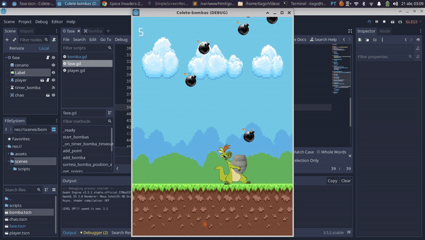

<h1 align="center">💣 Collecting Bombs 💣</h1>

  

## 🎮 Introduction

**Collecting Bombs** is a game developed using Godot 3. In this game, bombs continuously fall from the sky, and your goal as the player is to catch them before they hit the ground.

## ℹ️ About the Game

In **Collecting Bombs**, you move a character left and right to catch falling bombs. The game tests your reflexes and timing, offering a simple yet challenging gameplay experience. As the game progresses, the frequency and speed of the falling bombs increase, adding more difficulty.

## 🎮 Controls

- **A/D:** Move left/right
- **←/→ (Left/Right Arrow Keys):** Also move left/right

## 🕹️ How to Play

To start playing **Collecting Bombs**, follow these steps:

1. **Open Godot 3.**
2. **Select "Import Project"** on the Godot dashboard.
3. **Navigate to the cloned project directory.**
4. **Select the `project.godot` file** and click "Open Project."

To run the project:

1. **After opening the project in Godot, click the 'Play' button** in the top right corner to start the game.

## 📸 Screenshots

 Uncomment the following lines to show game screenshots

  

## 💻 Contributing

Feel free to fork the project, make changes, and open a pull request with any improvements you'd like to suggest. We welcome contributions from everyone!

## 🪪 License

This project is licensed under the MIT License. See the [LICENSE.md](LICENSE) file for details.
